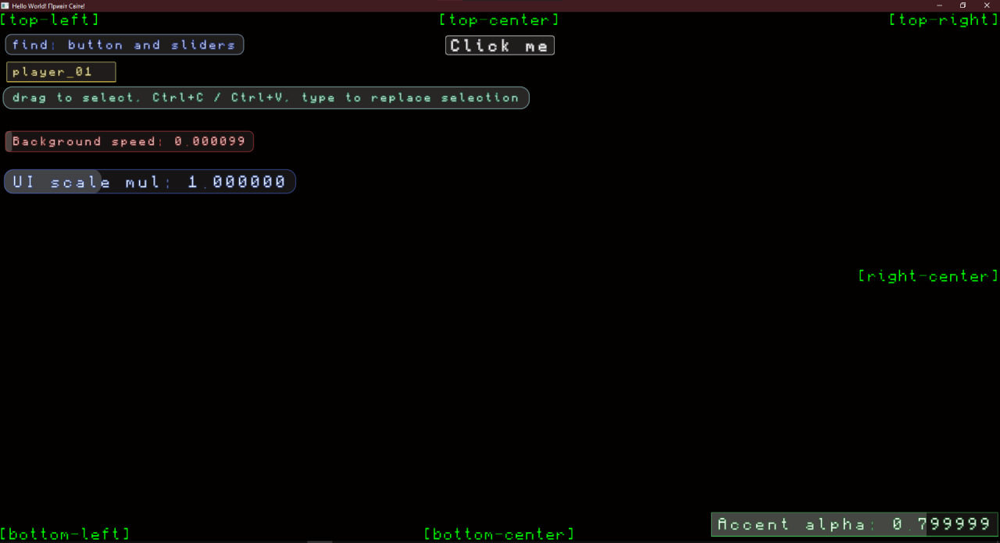

# hi - freestanding C++ framework

`hi` is a freestanding-first C++ framework for low-level applications:
- custom runtime (`io::`)
- filesystem (`fs::`)
- networking (`socket.hpp`, also `io::`)
- windowing + GUI + OpenGL loader (`hi::`, `gl::`)

The project is intentionally designed without STL/CRT assumptions in freestanding builds, with explicit ownership, predictable cost, and platform-isolated backends.

## Current Snapshot [gl.cpp](examples/gl.cpp)

- Primary targets: Windows x64/x86 and Linux x64/x86.
- Typical release binary size (measured on this repository): `83 KB` (Win32), `93 KB` (x64).
- Runtime profile for `examples/gl.cpp` (sample machine): CPU `1-5%`, GPU `3-10%` (GTX 1650), RAM `34-40 MB`.
- Default render pacing: `hi::Window` starts with VSync enabled and target FPS set to `144`.



## Project Goals

- Build practical systems software without mandatory hosted runtime dependencies.
- Keep API surface explicit: no hidden ownership, no hidden lifetime transfers.
- Keep performance predictable and measurable.
- Support real apps: GUI, networking, crypto, file IO, event loops.

## Achievements So Far

- Freestanding-friendly core runtime in `hi/io.hpp`.
- Cross-platform filesystem with UTF-8 API and platform-native conversion internally.
- UDP networking core with handshake, anti-spoof cookie challenge, reliable channel, and replay windowing.
- OpenGL window abstraction (OpenGL loader+window management) and immediate-mode GUI primitives.
- Font pipeline using freestanding `stb_truetype_stream` fork that plans atlas size up front, uses one dynamic allocation for generation, and supports SDF/MTSDF output.
- Catch-based tests across IO, filesystem, threading, crypto, networking, and GL behavior.

## Near-Term Plan

- Continue hardening Linux behavior and parity with Windows.
- Reduce per-frame dynamic allocations in GUI/input paths.
- Expand public API docs with strict behavior contracts and edge-case notes.
- Keep binary footprint low while adding features.

## Repository Layout

- `hi/` - public headers (`io.hpp`, `hi.hpp`, `socket.hpp`, `gl_loader.hpp`, crypto headers).
- `examples/` - runnable freestanding samples (`client`, `server`, `gl`) and test entry points.
- `examples/tests/` - Catch tests and test helpers (not freestanding, has STD dependencies).
- `3rd_party/` - bundled dependencies and forks.
- `CMakeLists.txt` + `CMakePresets.json` - build matrix and configs.

## Build Configurations

The project defines multi-config build modes:

- `Debug` - debug-oriented hosted build.
- `Release` - optimized hosted build.
- `ReleaseMini` - freestanding-focused minimal release.
- `ReleaseNoConsole` - GUI subsystem build.
- `ReleaseMiniNoConsole` - freestanding-focused GUI release.

## Build - Windows

### Requirements

- Visual Studio 2022 (Desktop C++).
- CMake 3.22+.
- Git.

### Configure

```bash
git clone --recurse-submodules https://github.com/setbe/hi.git
cd hi
cmake --list-presets
cmake --preset win64
```

For 32-bit:

```bash
cmake --preset win32
```

### Build examples

```bash
cmake --build build/win64 --config ReleaseMini --target client
cmake --build build/win64 --config ReleaseMini --target server
cmake --build build/win64 --config ReleaseMini --target gl
```

You can also open the generated solution in `build/win64` (or `build/win32`) and build targets in Visual Studio.

## Build - Linux

### Requirements

Install compiler + CMake + Ninja + X11/OpenGL development packages.

Debian/Ubuntu example:

```bash
sudo apt install build-essential cmake ninja-build git \
  libx11-dev libxrandr-dev libxinerama-dev libxcursor-dev libxi-dev \
  libgl1-mesa-dev libglu1-mesa-dev mesa-common-dev
```

### Configure

```bash
cmake --list-presets
cmake --preset l
```

For 32-bit Linux (multilib toolchain required):

```bash
cmake --preset l32
```

### Build examples

```bash
cmake --build build/l --config ReleaseMini --target client
cmake --build build/l --config ReleaseMini --target server
cmake --build build/l --config ReleaseMini --target gl
```

## Tests

Main test targets:

- `test_io_hi`
- `test_server`
- `test_client`
- `test_crypto`
- `test_gl`
- `test_thread`

Run examples (Windows path shown):

```bash
build/win64/Release/test_io_hi.exe
build/win64/Release/test_server.exe
build/win64/Release/test_client.exe
build/win64/Release/test_crypto.exe
build/win64/Release/test_gl.exe ~[interactive]
```

Important notes:

- `test_client` is intended to run only with external `server.exe` already running.
- `test_crypto` currently fails in X25519-related checks. That area is intentionally under active work.
- `test_gl` contains interactive and non-interactive cases; `~[interactive]` runs only non-interactive tests.

## Documentation

- Repository-level overview: this file.
- Full public API documentation: `hi/README.md`.

## Philosophy

- Explicit ownership.
- Explicit lifetime.
- Small and understandable abstractions.
- Platform control over hidden magic.
- Measurable performance over convenience wrappers.

## Status

Active development.  
APIs evolve, but the freestanding-first direction and explicit design principles are stable.
